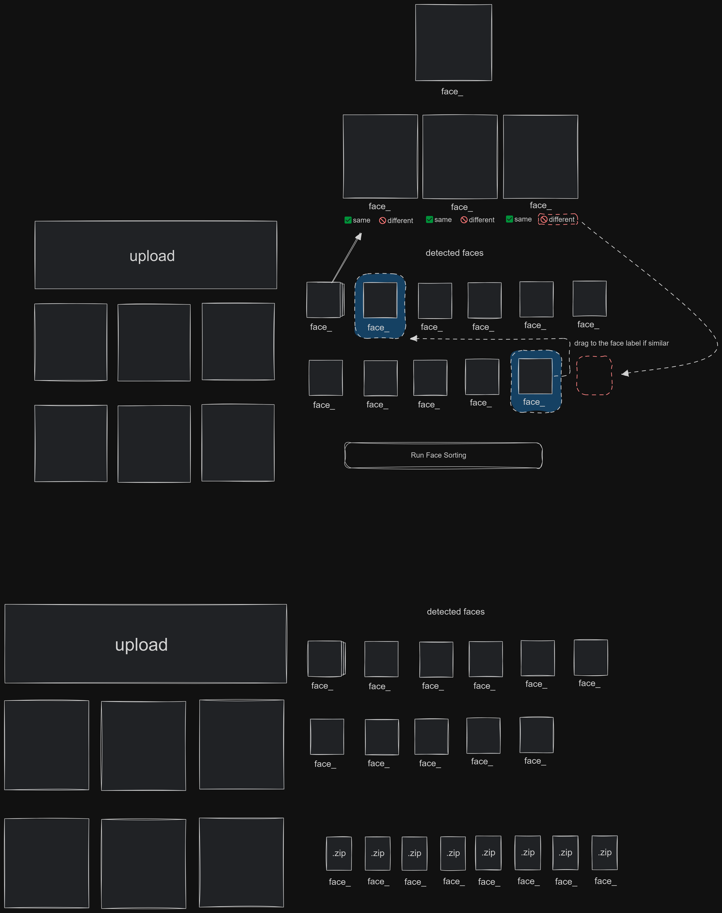
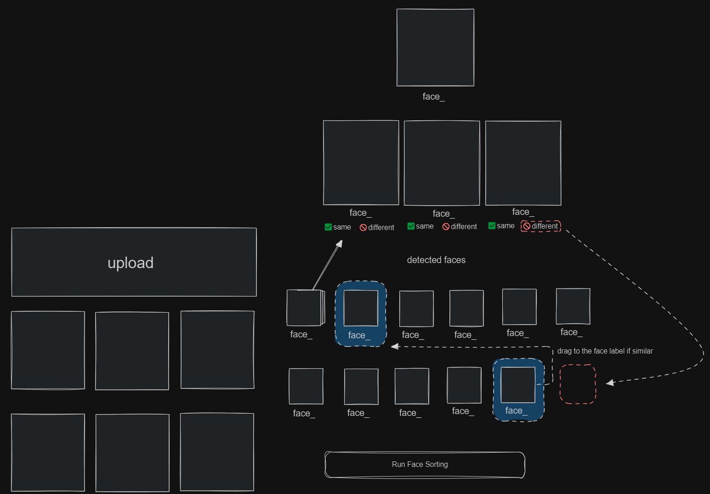
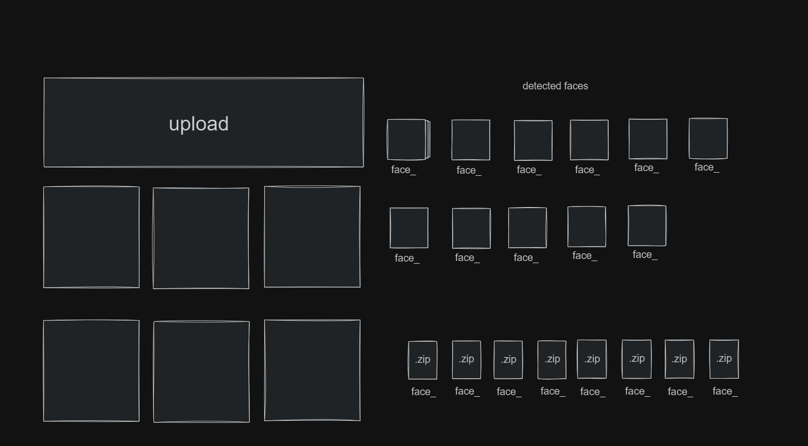

# FacialFileOrganizer

FacialFileOrganizer is an intelligent photo management system that uses facial recognition to automatically organize and categorize your photos based on the individuals present in them.

## Features

- Upload multiple photos via an intuitive drag-and-drop interface
- Automatic facial recognition and categorization
- Organize photos into folders based on recognized individuals
- User-friendly web interface built with React and TypeScript
- Efficient backend processing with Python

## How It Works

1. **Photo Upload**: Users upload photos through the web interface.

   

2. **Face Detection**: The system analyzes each photo to detect faces.

3. **Face Recognition**: Detected faces are compared against a database of known faces.

4. **Categorization**: Photos are organized into folders based on recognized individuals.

5. **Result Presentation**: Users can view their organized photos through the web interface.

   

## Technology Stack

### Frontend

- React with TypeScript

- Tailwind CSS for styling
<!-- - React-Dropzone for file uploads -->

### Backend

- Python
- FastAPI for API development
- face_recognition library for facial detection and recognition

### Storage

<!-- - Firebase Storage for photo storage -->

### Hosting

- Vercel for frontend hosting
<!-- - Heroku for backend hosting -->

## Installation

<!-- (Add installation instructions here) -->

## Usage

<!-- (Add usage instructions here) -->

## Contributing

Contributions to FacialFileOrganizer are welcome! Please read our contributing guidelines before submitting a pull request.

<!-- ## License

This project is licensed under the MIT License - see the [LICENSE.md](LICENSE.md) file for details. -->

## Acknowledgments

- Thanks to the creators of the face_recognition library
- Inspiration from Google Photos and similar services
